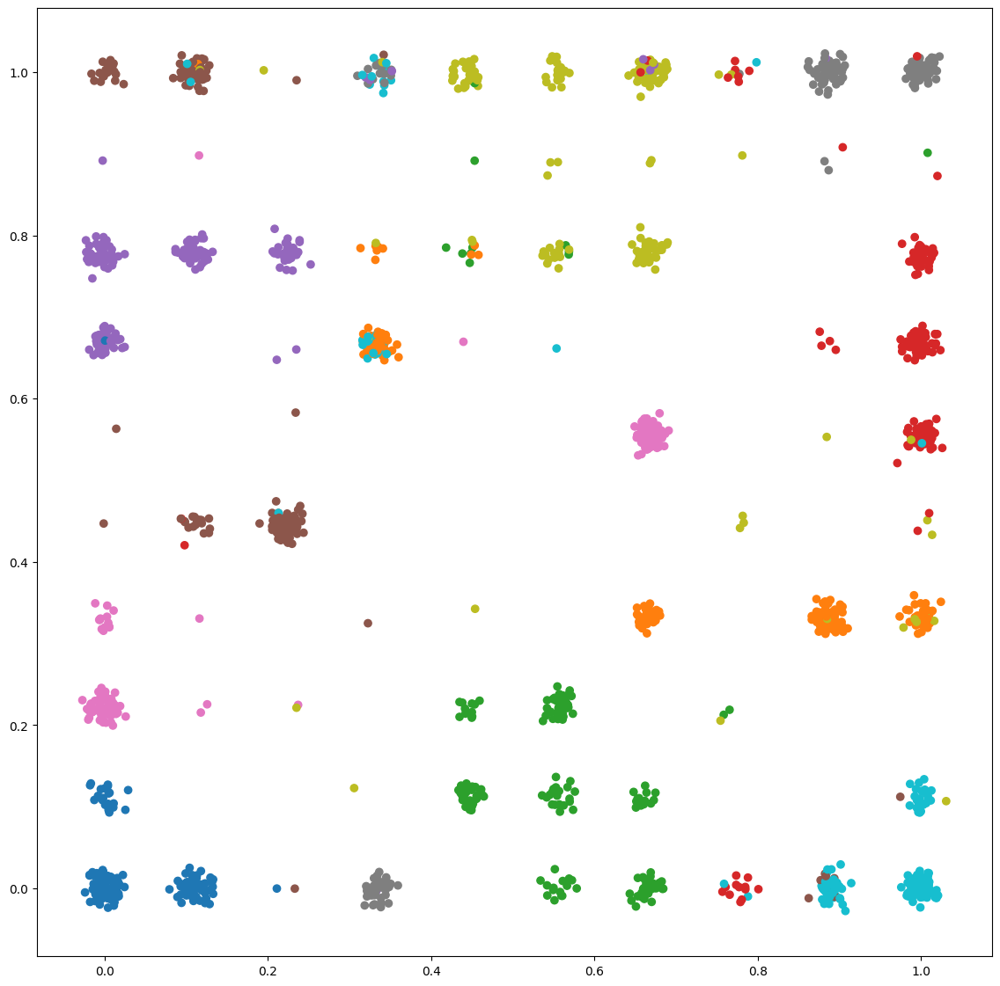
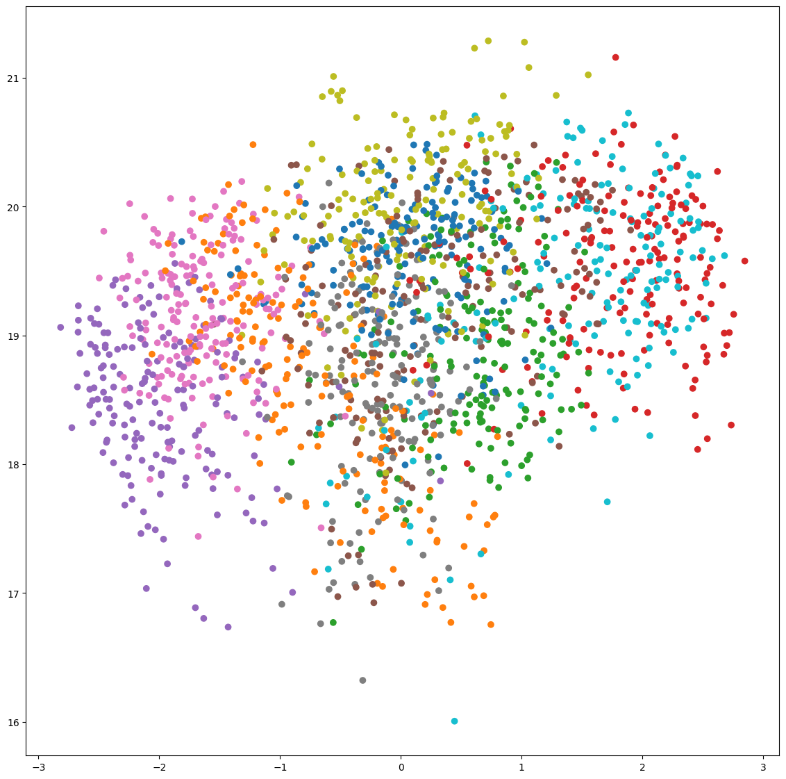
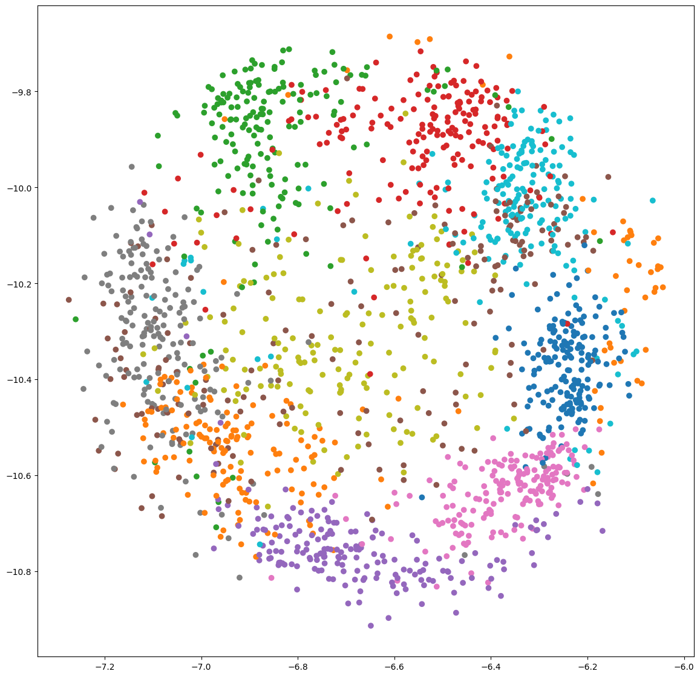
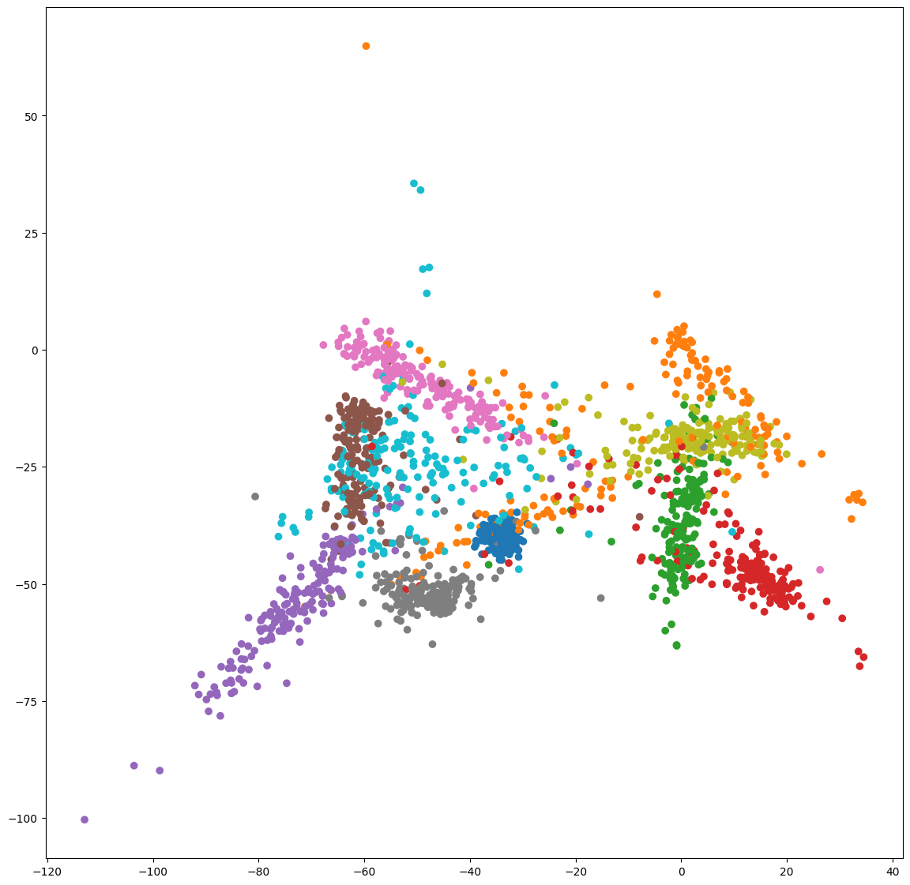

---

Is a tiny library consisting of embedding functions

See documentation, installation and usage information [here](https://jonasrsv.github.io/emby/build/html/index.html)

- Implemented
    - SOM (CPU) # (GPU for old version on older branch)
    - KernelPCA (CPU)
    - Metric Matching (CPU)
    - Preedy (CPU)
  

Examples 
---

See /examples for code examples and notebooks

digits data using SOM

digits data using kernelPCA with gaussian kernel

digits data using metric matching

digits data using preedy

