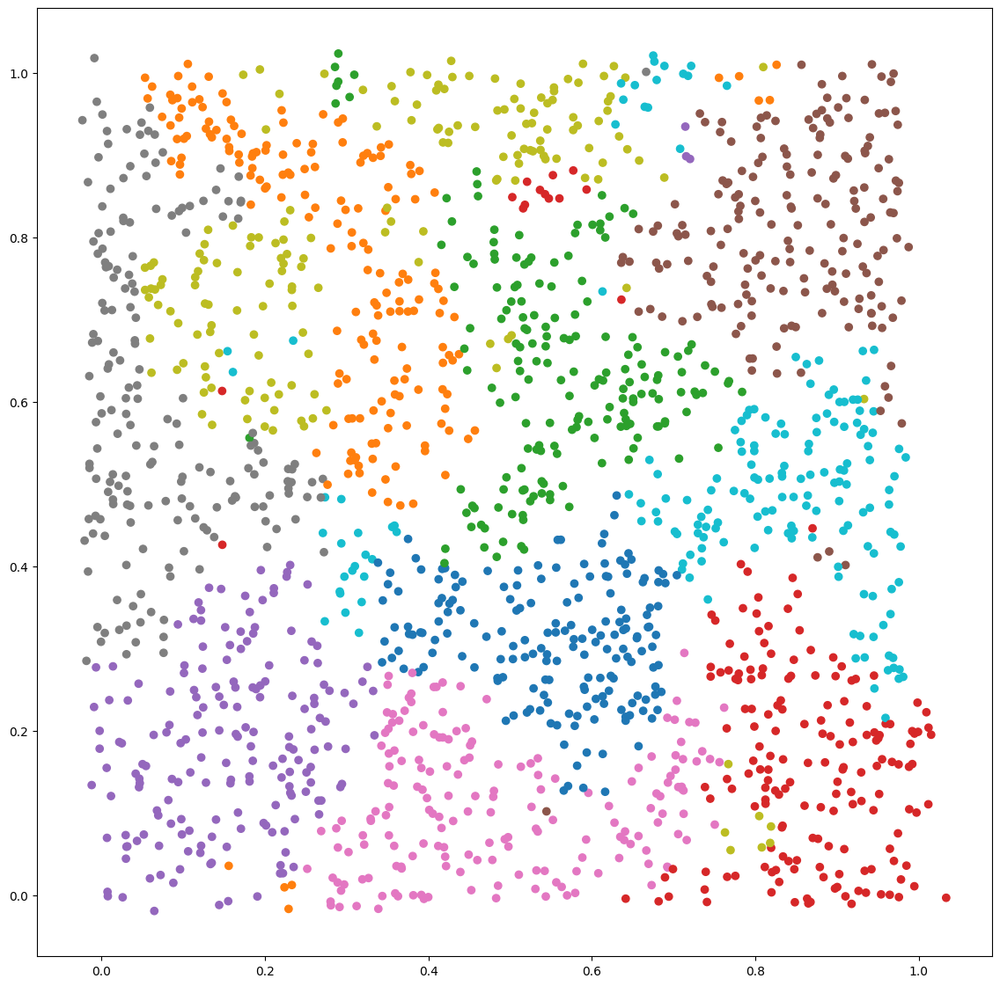

---

Is a tiny library consisting of embedding functions

See documentation, installation and usage information [here](https://jonasrsv.github.io/emby/build/html/index.html)

Now with GPU support for SOM!

```python
import emby
import time
from sklearn.datasets import load_digits

digits = load_digits()

x = digits.data
y = digits.target


som = emby.SOM(Z=2, bases=1000, device=emby.Device.CPU)

timestamp = time.time()
embeddings = som.fit_transform(x) 
print(f"Time to fit transform {time.time() - timestamp}")
# Time to fit transform 10.1866765022277832


som = emby.SOM(Z=2, bases=1000, device=emby.Device.GPU)

timestamp = time.time()
embeddings = som.fit_transform(x) 
print(f"Time to fit transform {time.time() - timestamp}")
# Time to fit transform 0.4181648063659668 20x speed-up!

```

Examples 
---

See /examples for code

Sklearn digits data using SOM



MNIST data using SOM


